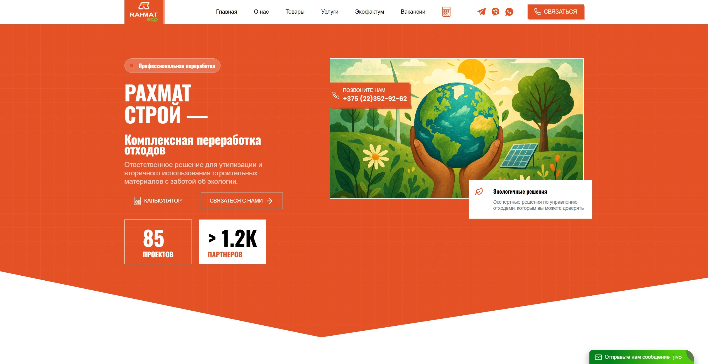
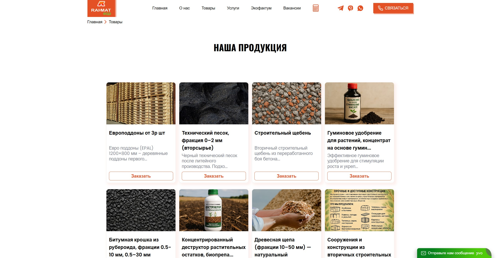
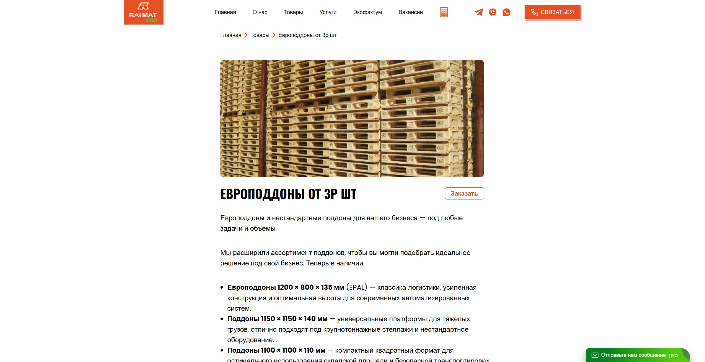
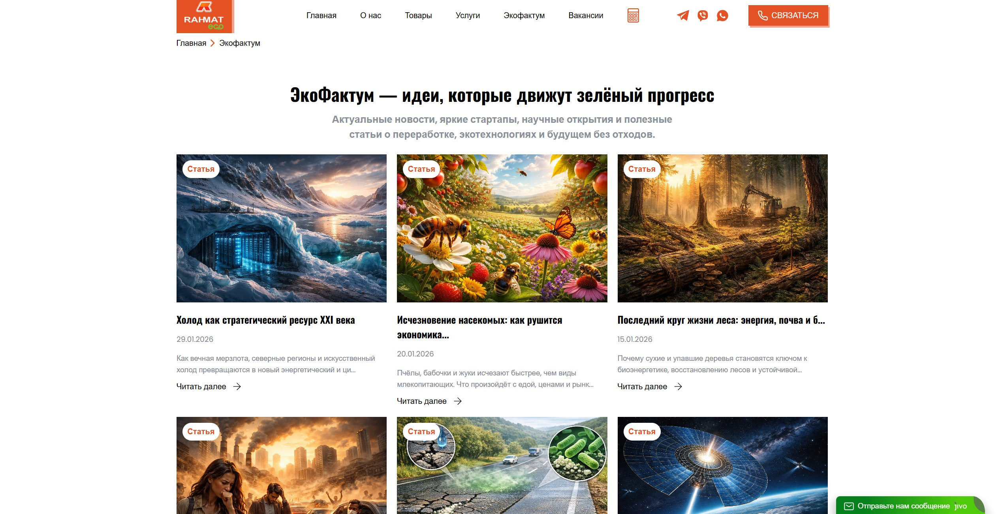
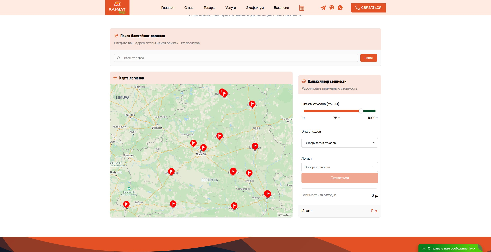

<div align="center">

# РАХМАТ СТРОЙ

### Корпоративная веб-платформа по переработке отходов и вторичным материалам

<br>



<br>

**[ Посмотреть сайт → ](https://rahmateko.by/)**

<br><br>


<br><br>

**Коммерческий проект · Full-stack разработка · Laravel · CMS**

</div>

---

# О проекте

**«Рахмат Строй»** — веб-платформа компании, работающей в сфере переработки строительных, древесных и битумосодержащих отходов.

Сайт объединяет несколько самостоятельных направлений в одном веб-приложении:

```text
                    РАХМАТ СТРОЙ
                          │
        ┌─────────────────┼─────────────────┐
        │                 │                 │
        ▼                 ▼                 ▼
     УСЛУГИ            ТОВАРЫ          ЭКОФАКТУМ
        │                 │                 │
        ▼                 ▼                 ▼
   Переработка         Каталог            Статьи
     отходов          продукции         и новости
        │                 │
        └────────┬────────┘
                 ▼
             КАЛЬКУЛЯТОР
                 │
        ┌────────┴────────┐
        ▼                 ▼
   Экологический        Расчёт 
      расчёт           стоимости
        └────────┬────────┘
                 │ 
                 ▼
            Форма связи
```

В проекте реализованы каталог продукции, страницы услуг, формы заявок, интерактивные калькуляторы, экологический информационный раздел  и интеграция карты с действующими предприятиями для переработки.

---

# Моя роль

### Full-stack разработка

Я отвечал за техническую реализацию проекта:

* проектирование архитектуры приложения;
* разработка backend на Laravel;
* проектирование структуры базы данных;
* разработка моделей и связей;
* создание Blade-шаблонов;
* разработка Livewire-компонентов;
* разработка пользовательского интерфейса;
* создание интерактивных форм;
* обработка заявок;
* разработка калькуляторов;
* каталог продукции;
* информационный раздел;
* SEO;
* адаптивная верстка;
* интеграции с внешними сервисами.

---

# Технологический стек

<table>
<tr>
<td width="50%">

### Backend

**PHP 8.3**
**Laravel 13**
**Eloquent ORM**
**Livewire**
**Filament**

</td>
<td width="50%">

### Frontend

**Blade**
**HTML5**
**CSS3**
**JavaScript**
**Livewire**

</td>
</tr>

<tr>
<td>

### Данные

**MySQL**
**Laravel Migrations**
**Eloquent Models**

</td>
<td>

### Интеграции

**Telegram Bot API**
**Карты**
**Внешние API**

</td>
</tr>
</table>

---

# Основные возможности

## Переработка отходов

На сайте представлены направления работы с различными категориями отходов:

* битумосодержащие отходы;
* древесные отходы;
* строительные отходы;

Также реализована большая таблица принимаемых отходов с единицами измерения, кодами, классами опасности и стоимостью.

---

## Каталог продукции

Отдельный раздел сайта посвящён продукции, получаемой из переработанных ресурсов.

В каталоге представлены, среди прочего:

* строительный щебень;
* битумная крошка;
* древесная щепа;
* гуминовые удобрения;
* деструкторы;
* европоддоны;
* другие материалы и продукты.

Для продукции предусмотрены отдельные страницы с описанием и информацией о применении.

```text
Каталог
│
├── Категории
│
├── Товары
│   ├── Название
│   ├── Описание
│   ├── Характеристики
│   ├── Применение
│   └── Изображения
│
└── Заявка
```

---

# Калькуляторы

Одной из наиболее заметных интерактивных частей проекта являются калькуляторы.

На сайте реализованы два сценария расчёта:

```text
                 КАЛЬКУЛЯТОР
                      │
             ┌────────┴────────┐
             │                 │
             ▼                 ▼
      ЭКОЛОГИЧЕСКИЙ       РАСЧЁТ СТОИМОСТИ
          РАСЧЁТ
             │                 │
             │                 ├── Объём отходов
             │                 ├── Вид отходов
             │                 ├── Транспорт
             │                 └── Расстояние
             │
             ├── Объём отходов
             ├── Вид отходов
             ├── Коэффициент
             │   утилизации
             │
             ▼
       Экологические
         показатели
```

Экологический расчёт позволяет оценить такие показатели, как:

* сокращение выбросов CO₂;
* экономия места на полигонах;
* сохранение природных ресурсов;
* экономия энергии.

Отдельный калькулятор используется для предварительного расчёта стоимости с учётом объёма отходов, их типа, транспорта и расстояния перевозки.

---

# ЭкоФактум

### Экологический информационный раздел

**«ЭкоФактум»** — отдельный контентный раздел проекта, посвящённый экологическим технологиям, исследованиям, стартапам и современным решениям в области экологии.

Структура:

```text
ЭкоФактум
│
├── Список публикаций
│
├── Карточка публикации
│   ├── Заголовок
│   ├── Изображение
│   ├── Дата
│   ├── Краткое описание
│   └── Содержание
│
└── Страница публикации
```

Раздел позволяет использовать сайт не только как корпоративную площадку, но и как информационный ресурс.

---

# Услуги

На главной странице представлены основные направления работы компании:

### Приём и переработка битумосодержащих отходов

Работа с рубероидом, кровельными материалами, асфальтовой крошкой и другими битумосодержащими материалами.

### Приём и переработка древесных отходов

Работа с опилками, ветками, щепой и стружкой.

### Приём и переработка строительных отходов

Сбор, сортировка и переработка бетона, кирпича, штукатурки и других строительных материалов.

---

# Интерактивность

Для интерактивных элементов используется **Livewire**.

Это позволяет создавать динамические компоненты непосредственно внутри Laravel-приложения без необходимости превращать проект в отдельное SPA.

В проекте интерактивность используется для:

* форм;
* заявок;
* калькуляторов;
* пользовательских действий;
* динамического интерфейса;
* обработки данных.

---

# Интеграции

Проект предусматривает работу с внешними сервисами.

### Telegram

Используется для уведомлений о пользовательских обращениях и заявках.

### Карты

Контактный раздел содержит интерактивную карту с расположением компании.

### Внешние сервисы

Архитектура приложения предусматривает подключение внешних API через конфигурацию Laravel.

---

# Интерфейс

## Главная страница


<br>

## Каталог продукции



<br>

## Страница товара



<br>

## ЭкоФактум



<br>

## Интеграция калькулятора с картой



<br>

---

# Особенности разработки

| Направление     | Реализация              |
| --------------- | ----------------------- |
| Архитектура     | Laravel                 |
| Backend         | PHP / Laravel           |
| База данных     | MySQL / Eloquent        |
| Шаблоны         | Blade                   |
| Интерактивность | Livewire                |
| CMS             | Filament                |
| Формы           | Livewire / Laravel      |
| Каталог         | Eloquent + Blade        |
| Калькуляторы    | Livewire                |
| SEO             | Динамические метаданные |
| Интеграции      | Telegram / карты / API  |
| Адаптивность    | Responsive UI           |

---

# Результат

Информация о компании, её деятельности, преимуществах и направлениях работы.

**Каталог продукции**

Структурированный каталог вторичных материалов и продукции.

**Сервисную часть**

Описание услуг по приёму и переработке отходов.

**Интерактивные инструменты**

Экологический и стоимостной калькуляторы.

**Информационный ресурс**

Раздел «ЭкоФактум» с публикациями.

**Систему заявок**

Формы для взаимодействия пользователей с компанией.

---

# Исходный код

> 🔒 **Коммерческий проект**

Исходный код проекта не публикуется, поскольку является частью коммерческой разработки.

Этот репозиторий создан исключительно как **портфолио-кейс** и содержит демонстрационные материалы, описание архитектуры и используемых технологий.

---

<div align="center">

## Технологии

**PHP · Laravel · Livewire · Filament · MySQL · Blade · JavaScript**

<br>

---

### Разработано

# XIMUNS

**Full-stack разработчик**

<br>

<a href="https://github.com/ximuns">

</a>

<br><br>

`Коммерческая разработка · Laravel · Full-stack`

</div>
